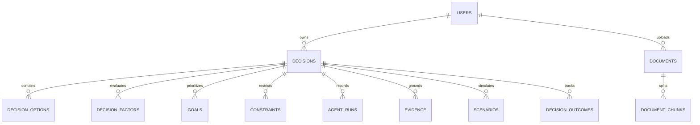

# FlowMind — AI Decision Intelligence Platform

<div align="center">

**Think clearly. Decide intelligently.**

*An AI-native decision workspace transforming complex dilemmas, offer letters, documents, and trade-offs into an interactive, explainable, and stress-tested decision model.*

[](https://python.org)
[](https://fastapi.tiangolo.com)
[](https://react.dev)
[](https://www.typescriptlang.org/)
[](https://tailwindcss.com)
[](https://docker.com)
[](LICENSE)

</div>

---

## 1. Executive Summary

Real-world decisions (career transitions, venture investments, technical architectures, business pivots) are rarely linear. Traditional LLM chats provide generic bullet points that suffer from confirmation bias and lack grounded citations.

**FlowMind** is a new category of **AI-native decision workspace**. It replaces conventional dashboards and chat windows with an interactive spatial decision canvas, a 7-agent adversarial reasoning council, grounded RAG document intelligence, a dynamic "What-If" simulator, and an adversarial "Challenge My Decision" engine.

---

## 2. Core Capabilities

### 🌌 1. Focused Entry Workspace
- **Zero-form friction**: Begin with free-form thought: *"Should I accept Job A at a high-growth startup, Job B at BigTech, or pursue higher studies?"*
- One-click additions for options, constraints, goals, and evidence documents.

### 🗺️ 2. Interactive Spatial Decision Space
- Spatial node graph with pan, zoom, expand/collapse, and inspect capabilities.
- Visual hierarchy connecting Root Dilemmas → Evaluation Factors → Option Branches → Grounded Citations → Contradictions.

### 🤖 3. Multi-Agent Reasoning Council
A dedicated team of 7 specialized AI agents operates in iterative debate:
1. **Analyst Agent**: Deconstructs objective structure, facts, constraints, and identifies missing information.
2. **Optimist Agent**: Models upside acceleration, skill multipliers, and positive asymmetrical outcomes.
3. **Skeptic Agent**: Interrogates failure modes, weak assumptions, hidden costs, and operational friction.
4. **Financial Analyst**: Evaluates compensation certainty, cash flow, opportunity costs, and ROI.
5. **Long-Term Planner**: Evaluates reversibility (Type 1 vs Type 2 decisions), 5-year trajectories, and compounding optionality.
6. **Devil's Advocate**: Contrarian stress-tester that attacks confirmation bias and hunts for fragilities.
7. **Synthesizer Agent**: Arbitrates debates, balances multi-factor scores, and derives final and alternative recommendations.

### ⚔️ 4. "Challenge My Decision" Engine
- An adversarial stress-test that actively attacks the prevailing recommendation.
- Exposes hidden vulnerabilities, executes a confidence haircut (e.g., `82%` → `68%`), and delivers a model fragility verdict (`Robust`, `Moderately Sensitive`, or `Fragile`).

### 🎛️ 5. Dynamic "What-If" Simulator
- Tweak real-world parameters: salary shifts (`-30%` to `+50%`), remote work priority, and time horizons (1 to 7 years).
- Live recalculation displaying a before-vs-after delta explanation with updated scores.

### 📑 6. Document Intelligence & Grounded Citations (RAG)
- Ingest PDFs, DOCX, TXT, and CSV files (offer letters, contracts, thesis notes).
- Chunks text, builds vector embeddings, and links every critical claim directly to source excerpts and page numbers.

### ⏱️ 7. Decision History & Outcome Feedback Loop
- Log real decisions and return 6-12 months later to record actual lived outcomes.
- Compares AI accuracy ratings with personal satisfaction scores to calibrate strategic intuition over time.

### ⌨️ 8. Global Command Palette (`⌘K` / `Ctrl+K`)
- Instant keyboard-driven navigation for creating decisions, uploading documents, launching simulations, and challenging recommendations.

---

## 3. Architecture

```
                                  FLOWMIND ARCHITECTURE
                                  
    +-------------------------------------------------------------------------+
    |                             FRONTEND (SPA)                              |
    |   React 18 + TypeScript + Vite + Tailwind CSS + Lucide Icons            |
    |   Spatial Canvas  |  Agent Council  |  What-If Lab  |  Evidence Drawer  |
    +-------------------------------------------------------------------------+
                                         │  (HTTP / JSON REST)
                                         ▼
    +-------------------------------------------------------------------------+
    |                             BACKEND API                                 |
    |                   FastAPI + Pydantic v2 + Uvicorn                       |
    |                                                                         |
    |   [/api/auth]    [/api/decisions]    [/api/documents]    [/api/simulate] |
    +-------------------------------------------------------------------------+
          │                                                  │
          ▼                                                  ▼
+───────────────────────────+                     +───────────────────────────+
|   MULTI-AGENT PIPELINE    |                     |     RAG VECTOR ENGINE     |
| • Analyst Agent           |                     | • Text Extractor (PDF/DOC)|
| • Optimist Agent          |                     | • Semantic Text Chunker   |
| • Skeptic Agent           |                     | • Vector Normalizer       |
| • Financial Analyst       |                     | • Cosine Similarity Index |
| • Long-Term Planner       |                     +───────────────────────────+
| • Devil's Advocate (⚔️)   |                                    │
| • Synthesizer Agent       |                                    ▼
+───────────────────────────+                     +───────────────────────────+
          │                                       |      DATABASE LAYER       |
          └──────────────────────────────────────►|  PostgreSQL / SQLite      |
                                                  |  SQLAlchemy 2.0 ORM       |
                                                  +───────────────────────────+
```

---

## 4. Tech Stack

| Layer | Technology | Purpose |
|---|---|---|
| **Backend** | Python 3.11+, FastAPI | Asynchronous high-performance REST API |
| **Data Validation** | Pydantic v2, email-validator | Strict request/response serialization |
| **Database & ORM** | SQLAlchemy 2.0, SQLite / PostgreSQL | Relational modeling, migrations, session pooling |
| **Security** | PBKDF2-SHA256, Python-Jose (JWT) | Secure password hashing, token verification |
| **Document RAG** | PyPDF, python-docx, In-Memory Cosine Engine | Multi-format text extraction and semantic search |
| **AI Agents** | Async Orchestrator (Multi-Provider: Gemini / Groq / OpenAI / Deterministic) | Multi-stage parallel debate & synthesis |
| **Frontend** | React 18, TypeScript, Vite | Fast, type-safe client application |
| **Styling & Theme** | Tailwind CSS v4, Custom Spatial Obsidian Palette | Premium, dark-mode native interface |
| **Icons & Motion** | Lucide React | Clean, scalable visual language |
| **Containerization** | Docker, Docker Compose, Nginx | Multi-stage production deployment |

---

## 5. Relational Database Schema



---

## 6. Installation & Local Development

### Prerequisites
- **Python**: 3.11 or higher
- **Node.js**: v18 or higher (v22 recommended)
- **npm**: 9+ or yarn

### 1. Clone Repository
```bash
git clone https://github.com/your-username/FlowMind.git
cd FlowMind
```

### 2. Configure Environment
```bash
cp .env.example .env
```
*(Default settings use local SQLite with instant zero-configuration setup).*

### 3. Setup & Run Backend
```bash
# Install dependencies
pip install -r backend/requirements.txt

# Run automated tests
python -m pytest backend/tests/test_api.py

# Start FastAPI server
uvicorn backend.app.main:app --host 127.0.0.1 --port 8000 --reload
```
API Documentation will be live at: `http://localhost:8000/docs`.

### 4. Setup & Run Frontend
```bash
cd frontend
npm install

# Test production build
npm run build

# Start Vite dev server
npm run dev
```
FlowMind workspace will be live at: `http://localhost:5173`.

---

## 7. Running with Docker Compose

To launch PostgreSQL, the FastAPI backend, and the Nginx frontend bundle with a single command:

```bash
docker compose up --build
```
- **Frontend**: `http://localhost:3000`
- **Backend API**: `http://localhost:8000`
- **PostgreSQL**: `localhost:5432`

---

## 8. API Reference Summary

| Method | Endpoint | Description |
|---|---|---|
| `POST` | `/api/auth/register` | Register a new user |
| `POST` | `/api/auth/login` | Authenticate and obtain JWT token |
| `GET` | `/api/auth/me` | Retrieve active profile & scoped preferences |
| `GET` | `/api/decisions` | List decisions for current user |
| `POST` | `/api/decisions/quick` | Fast free-form prompt creation & auto-orchestration |
| `GET` | `/api/decisions/{id}` | Fetch full decision model, options, and agent runs |
| `DELETE`| `/api/decisions/{id}` | Delete decision model |
| `POST` | `/api/decisions/{id}/analyze` | Trigger full 7-agent orchestration cycle |
| `POST` | `/api/decisions/{id}/challenge` | Run Devil's Advocate adversarial challenge (⚔️) |
| `POST` | `/api/decisions/{id}/simulate` | Run dynamic What-If parameter simulation |
| `POST` | `/api/decisions/{id}/outcomes` | Log real-world outcome and satisfaction ratings |
| `POST` | `/api/documents/upload` | Ingest PDF/DOCX document into RAG vector memory |

---

## 9. Testing

```bash
# Run backend pytest suite
python -m pytest backend/tests/test_api.py -v

# Run frontend build and type checks
cd frontend && npm run build
```

---

## 10. License

This project is licensed under the [MIT License](LICENSE).
